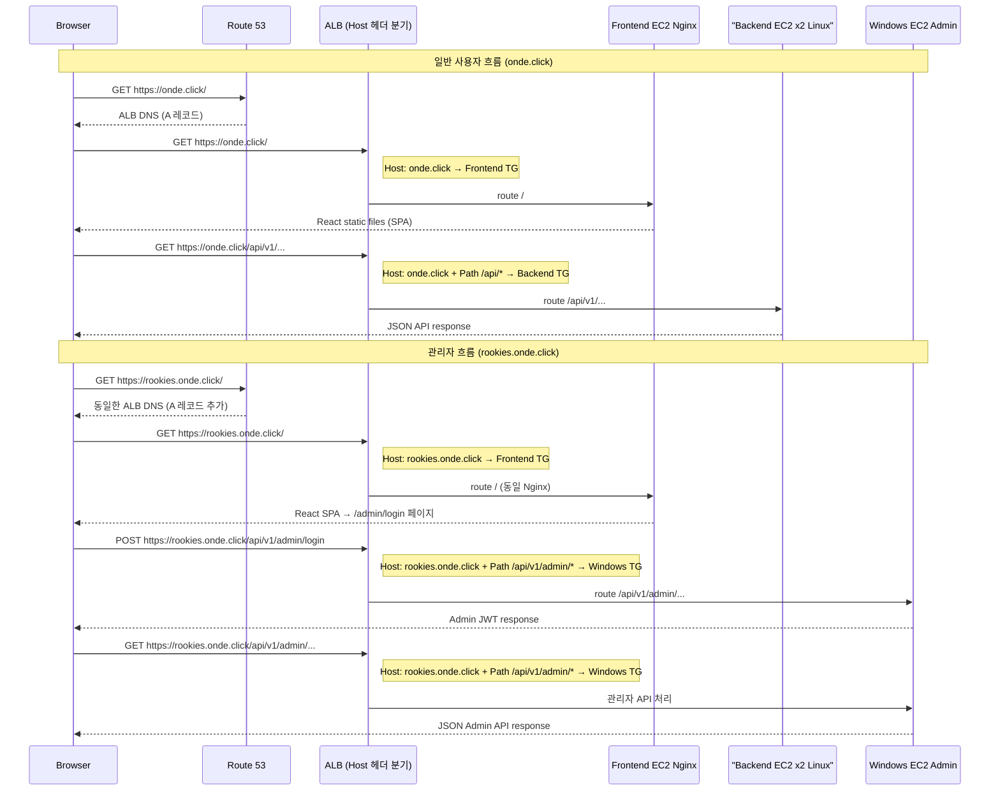

# Onde Infra

> SK쉴더스 루키즈 개발 5기 최종 프로젝트 — LBS 기반 여행 예약 및 동행 커뮤니티 플랫폼 **Onde** 서비스를 AWS 기반으로 배포하기 위한 인프라 레포지토리입니다.

---

## 목차

- [프로젝트 개요](#프로젝트-개요)
- [전체 구조](#전체-구조)
- [핵심 개념 설명](#핵심-개념-설명)
  - [Terraform](#1-terraform)
  - [AWS VPC](#2-aws-vpc-virtual-private-cloud)
  - [AWS EC2](#3-aws-ec2-elastic-compute-cloud)
  - [AWS RDS](#4-aws-rds-relational-database-service)
  - [AWS S3](#5-aws-s3-simple-storage-service)
  - [AWS ALB](#6-aws-alb-application-load-balancer)
  - [AWS ACM](#7-aws-acm-certificate-manager)
  - [AWS Route 53](#8-aws-route-53)
  - [AWS SSM Parameter Store](#9-aws-ssm-parameter-store)
  - [AWS CloudFront](#10-aws-cloudfront)
  - [Docker](#11-docker)
  - [Nginx](#12-nginx)
- [통신 흐름 상세 설명](#통신-흐름-상세-설명)
- [리포지토리 구조](#리포지토리-구조)
- [로컬 개발 및 빌드](#로컬-개발-및-빌드)
- [배포 및 인프라](#배포-및-인프라)
- [환경 및 요구사항](#환경-및-요구사항)

---

## 프로젝트 개요

이 저장소는 Onde 서비스의 인프라 관련 파일을 모아둔 곳입니다. 인프라란 서비스가 실제로 인터넷에서 동작하기 위해 필요한 서버, 네트워크, 데이터베이스 등의 기반 환경을 의미합니다.

포함된 항목:

- **Terraform 코드** (`terraform/`) — AWS 리소스를 코드로 자동 생성
- **Docker 파일** (`docker/`) — 애플리케이션 컨테이너 이미지 빌드

---

## 전체 구조


---
# Onde 전체 인프라 아키텍처 다이어그램

```mermaid
flowchart TB
  user[User Browser]
  adminUser[Admin Browser]
  r53["Route 53
onde.click A Alias
rookies.onde.click A Alias"]
  acm["ACM Certificate
onde.click"]
  gha["GitHub Actions
Build / Test / Docker Push"]
  repo["GitHub Repositories
Onde_Backend / Onde_Frontend / onde_infra"]

  subgraph aws[AWS Cloud]
    subgraph ecrs[ECR Repositories]
      ecrFE["ECR onde/frontend
React + Nginx 이미지"]
      ecrBE["ECR onde/backend
Spring Boot API 이미지"]
      ecrAdmin["ECR onde/backend-admin
Spring Boot Admin 이미지"]
    end

    subgraph vpc["VPC  10.0.0.0/16"]
      igw[Internet Gateway]

      subgraph public["Public Subnets 10.0.1.0/24 10.0.2.0/24  ap-northeast-2a 2c"]
        alb["ALB onde-alb
Internet-facing
HTTP to HTTPS 301 Redirect
HTTPS 443 ACM 인증서 적용"]
        natEip["Elastic IP
for NAT Gateway"]
        nat["NAT Gateway
단일 AZ public-1"]
      end

      subgraph private["Private Subnets 10.0.10.0/24 10.0.20.0/24  ap-northeast-2a 2c"]
        fe["Frontend EC2  t3.small  Ubuntu 22.04
Nginx React SPA 정적 서빙
Public Subnet ALB에서만 접근"]
        be1["Backend EC2-1  t3.small  Ubuntu 22.04
Spring Boot API api-module port 8080
Private Subnet ap-northeast-2a"]
        be2["Backend EC2-2  t3.small  Ubuntu 22.04
Spring Boot API api-module port 8080
Private Subnet ap-northeast-2c"]
        win["Windows EC2  t3.medium  Windows Server 2019
Spring Boot Admin admin-module port 8081
Private Subnet ap-northeast-2a"]
      end

      subgraph dbSubnet["DB Subnets 10.0.100.0/24 10.0.200.0/24  인터넷 차단 완전 격리"]
        rds["RDS MariaDB 10.11  db.t3.small
암호화 true  자동백업 7일
감사로그 to CloudWatch  port 3306"]
        redis["ElastiCache Redis 7  cache.t3.micro
Replication Group  1 node  port 6379"]
      end
    end

    subgraph storage[Storage]
      s3Img["S3 onde-travel-image-bucket
이미지 저장  버전관리  암호화
퍼블릭 차단  CloudFront OAC만 허용"]
      s3Trail["S3 onde-cloudtrail-logs
CloudTrail 감사 로그 저장"]
      s3Deploy["S3 onde-deploy-artifacts
Windows EC2 배포 JAR 저장"]
    end

    cf["CloudFront Distribution
S3 이미지 CDN  OAC 인증
PriceClass_100  HTTPS 강제"]

    secretsMgr["Secrets Manager
onde-project/backend-*
DB / JWT / OAuth / S3 / AES 등"]

    ssm["SSM Session Manager
EC2 키리스 접속  SSH 포트 없음"]

    cw["CloudWatch
RDS 감사 에러 로그
ALB 액세스 메트릭
EC2 CPU 네트워크 경보  SNS 알림"]

    ct["CloudTrail
API 호출 감사 로그
to S3 cloudtrail-logs"]

    iam["IAM Role  ec2-ssm-role
SSM / ECR pull / S3 접근
Secrets Manager 읽기"]
  end

  user -->|"HTTPS onde.click"| r53
  adminUser -->|"HTTPS rookies.onde.click"| r53
  r53 -->|"A Alias to ALB DNS"| igw
  igw <--> alb
  acm -->|"HTTPS 리스너 인증서"| alb

  alb -->|"onde.click /  default"| fe
  alb -->|"onde.click /api/* /oauth2/*  priority 10"| be1
  alb -->|"onde.click /api/* /oauth2/*  priority 10"| be2
  alb -->|"rookies.onde.click /api/v1/admin/*  priority 2"| win
  alb -->|"rookies.onde.click /  priority 3"| fe

  be1 -->|"JDBC 3306"| rds
  be2 -->|"JDBC 3306"| rds
  win -->|"JDBC 3306"| rds

  be1 -->|"Redis 6379"| redis
  be2 -->|"Redis 6379"| redis
  win -->|"Redis 6379"| redis

  be1 -->|"S3 PutObject GetObject"| s3Img
  be2 -->|"S3 PutObject GetObject"| s3Img

  s3Img -->|"OAC 서명"| cf
  cf -->|"이미지 CDN"| user

  natEip --> nat
  be1 & be2 & win -->|"NAT 경유 아웃바운드"| nat
  nat --> igw

  fe -->|"docker pull via NAT"| ecrFE
  be1 & be2 -->|"docker pull via NAT"| ecrBE
  win -->|"docker pull via NAT"| ecrAdmin

  iam -->|"ec2 instance profile"| fe & be1 & be2 & win
  be1 & be2 & win -->|"GetSecretValue"| secretsMgr
  be1 & be2 & win -->|"keyless access"| ssm

  rds -->|"감사 에러 로그"| cw
  alb -->|"액세스 메트릭"| cw
  ct -->|"API 감사 로그"| s3Trail

  repo --> gha
  gha -->|"docker push"| ecrFE & ecrBE & ecrAdmin
  gha -->|"JAR upload"| s3Deploy
  s3Deploy -->|"GetObject 배포"| win
```




---

## 컴포넌트 요약

| 컴포넌트 | 스펙 | 위치 | 역할 |
|----------|------|------|------|
| **ALB** | Application Load Balancer | Public Subnet | HTTPS 종단, Host/Path 기반 라우팅 |
| **Frontend EC2** | t3.small Ubuntu 22.04 | Public Subnet | Nginx React SPA 서빙 |
| **Backend EC2 x2** | t3.small Ubuntu 22.04 | Private Subnet 2AZ | Spring Boot API api-module |
| **Windows EC2** | t3.medium Windows 2019 | Private Subnet | Spring Boot Admin admin-module :8081 |
| **RDS MariaDB** | db.t3.small 10.11 | DB Subnet 격리 | 메인 데이터베이스 |
| **ElastiCache Redis** | cache.t3.micro Redis 7 | DB Subnet | 세션/캐시 |
| **S3 이미지** | - | 글로벌 | 여행 이미지 저장 |
| **S3 CloudTrail** | - | 글로벌 | 감사 로그 저장 |
| **S3 배포** | - | 글로벌 | Windows JAR 배포용 |
| **CloudFront** | PriceClass_100 | 글로벌 | S3 이미지 CDN |
| **ECR** | 3개 레포 | ap-northeast-2 | 도커 이미지 저장 |
| **Secrets Manager** | onde-project/backend-* | ap-northeast-2 | 민감정보 관리 |
| **CloudWatch** | - | ap-northeast-2 | 로그 / 메트릭 / 알람 |
| **CloudTrail** | - | ap-northeast-2 | API 감사 |
| **Route 53** | A Alias 계획 | 글로벌 | onde.click / rookies.onde.click |
| **ACM** | onde.click 인증서 | ap-northeast-2 | HTTPS 인증서 |

---

# Onde 도메인 분리 시퀀스 다이어그램

## 아키텍처 흐름



## ALB 라우팅 우선순위 요약

| Priority | Host 조건 | Path 조건 | Target Group |
|----------|-----------|-----------|--------------|
| **2** | `rookies.onde.click` | `/api/v1/admin/*` | Windows EC2 TG |
| **3** | `rookies.onde.click` | `*` (전체) | Frontend TG |
| **10** | `onde.click` | `/api/*`, `/oauth2/*`, `/login/oauth2/*` | Linux Backend TG |
| **default** | `onde.click` | `*` | Frontend TG |

> 기존 priority 5 규칙(`onde.click`에서 `/api/v1/admin/*` 허용)은 **삭제** — admin API는 `rookies.onde.click`으로만 접근 가능

## Route 53 레코드

| 도메인 | 타입 | 값 |
|--------|------|-----|
| `onde.click` | A (Alias) | ALB DNS (기존) |
| `rookies.onde.click` | A (Alias) | ALB DNS (동일, 신규 추가) |

---

## 핵심 개념 설명

인프라를 처음 접하는 팀원을 위해, 이 프로젝트에서 사용된 모든 기술과 개념을 설명합니다.

---

### 1. Terraform

#### 한 줄 요약
> AWS 리소스(서버, 네트워크 등)를 코드로 자동 생성/관리하는 도구

#### 왜 사용하나요?
AWS 콘솔에서 클릭클릭해서 서버를 만들면 설정이 어딘가에 기록되지 않아 나중에 똑같이 만들기 어렵습니다. 
Terraform을 사용하면 `.tf` 파일에 코드로 인프라를 정의하고, 명령어 한 번으로 AWS에 자동으로 생성할 수 있습니다.

#### 핵심 명령어
```bash
terraform init    # 초기화 (필요한 플러그인 다운로드)
terraform plan    # 어떤 리소스가 생성/변경/삭제될지 미리 확인
terraform apply   # 실제로 AWS에 리소스 생성
terraform destroy # 생성한 리소스 전체 삭제
```

#### 비유
레고 설명서처럼, 코드에 "VPC 1개, EC2 2개, RDS 1개 만들어줘"라고 적어두면 Terraform이 AWS에 자동으로 조립해줍니다.

---

### 2. AWS VPC (Virtual Private Cloud)

#### 한 줄 요약
> AWS 내에서 우리만 사용하는 격리된 가상 네트워크 공간

#### 왜 사용하나요?
AWS에는 전 세계 수많은 고객의 서버가 있습니다. 
VPC는 그 중에서 우리 서비스만의 독립된 가상 네트워크를 만들어, 외부에서 함부로 접근하지 못하도록 격리합니다.

#### 주요 구성요소
| 용어 | 설명 |
|------|------|
| **서브넷(Subnet)** | VPC 안의 더 작은 네트워크 구역. 퍼블릭(인터넷 가능)과 프라이빗(내부 전용)으로 구분 |
| **인터넷 게이트웨이** | VPC와 인터넷을 연결하는 문 |
| **보안 그룹(Security Group)** | EC2 등에 붙이는 방화벽. 어떤 포트/IP만 허용할지 설정 |
| **라우팅 테이블** | 네트워크 트래픽이 어디로 갈지 결정하는 지도 |

#### 비유
VPC는 회사 전용 사무실 건물이고, 서브넷은 층별 구역(1층=퍼블릭, 지하=프라이빗), 보안 그룹은 출입문 보안카드입니다.

---

### 3. AWS EC2 (Elastic Compute Cloud)

#### 한 줄 요약
> AWS에서 빌려 쓰는 가상 서버 (컴퓨터)

#### 왜 사용하나요?
우리 애플리케이션(프론트엔드, 백엔드)이 실제로 실행되는 서버입니다. 물리적인 서버를 직접 구매할 필요 없이 AWS에서 필요한 만큼 빌려서 사용합니다.

#### 이 프로젝트에서의 역할
- EC2 위에 Docker를 설치하고, 그 위에서 프론트엔드/백엔드 컨테이너를 실행합니다.
- Terraform으로 EC2를 자동 생성하고, Docker 실행 환경을 구성합니다.
- 애플리케이션 배포는 GitHub Actions를 통해 자동화되며, 코드가 Push되면 Docker 이미지를 빌드하여 ECR에 푸시한 뒤 EC2에서 컨테이너를 재시작하는 방식으로 운영됩니다.

  = 택배 시스템에 비유하면, 개발자가 코드를 GitHub에 Push하는 것이 "상품 주문"이고, GitHub Actions가 Docker 이미지를 빌드해서 ECR에 올리는 것이 "상품 포장 및 물류센터 입고", EC2에서 새 이미지로 컨테이너를 재시작하는 것이 "고객(서버)에게 배송 완료"입니다. 개발자는 주문만 하면 나머지는 자동으로 처리됩니다.

#### 비유
EC2는 AWS가 운영하는 PC방의 컴퓨터 한 대를 빌리는 것과 같습니다. 사양을 골라서 원할 때 켜고 끌 수 있습니다.

---

### 4. AWS RDS (Relational Database Service)

#### 한 줄 요약
> AWS에서 관리해주는 관계형 데이터베이스 서비스

#### 왜 사용하나요?
사용자 정보, 여행 예약 데이터 등을 저장하는 데이터베이스입니다. EC2에 직접 MariaDB를 설치할 수도 있지만, RDS를 사용하면 AWS가 백업, 패치, 장애 복구를 자동으로 관리해줍니다.

#### 특징
- EC2에서 직접 접근 가능 (프라이빗 서브넷에 위치하여 외부 직접 접근 차단)
- 자동 백업 및 스냅샷 기능
- Multi-AZ 옵션으로 가용성 확보 가능

#### 비유
직접 냉장고를 사서 관리하는 대신, 음식 보관 서비스를 구독하는 것과 같습니다. 유지보수는 서비스 업체가 합니다.

---

### 5. AWS S3 (Simple Storage Service)

#### 한 줄 요약
> 무제한 용량의 파일(이미지, 동영상, 문서 등) 저장 서비스

#### 왜 사용하나요?
여행 사진, 프로필 이미지 등 파일을 저장합니다. 서버에 파일을 저장하면 서버가 재시작될 때 파일이 사라질 수 있지만, S3는 별도의 저장소이므로 영구적으로 보관됩니다.

#### 이 프로젝트에서의 역할
- 사용자 업로드 이미지 파일 저장 (CloudFront를 통해 서빙)
- Windows 백엔드 배포용 JAR 파일 저장
- CloudTrail API 감사 로그 저장

#### 비유
구글 드라이브나 드롭박스처럼, 파일을 인터넷 어딘가에 안전하게 올려두는 서비스입니다.

---

### 6. AWS ALB (Application Load Balancer)

#### 한 줄 요약
> 여러 서버로 들어오는 트래픽을 적절히 분산시켜주는 장치

#### 왜 사용하나요?
사용자가 `onde.click`에 접속하면 ALB가 가장 먼저 요청을 받습니다. 그리고 요청의 URL 경로를 보고 어느 서버로 보낼지 결정합니다.

#### 이 프로젝트에서의 라우팅 규칙
```
https://onde.click/admin/... → Windows 백엔드 서버로 전달 (priority 5)
https://onde.click/api/v1/... → Linux 백엔드 서버로 전달 (priority 10)
https://onde.click/...       → 프론트엔드 서버로 전달 (기본)
```

#### 주요 기능
| 기능 | 설명 |
|------|------|
| **경로 기반 라우팅** | URL 경로(/api, /admin 등)에 따라 다른 서버로 연결 |
| **HTTPS 종료** | ACM 인증서로 암호화/복호화 처리 |
| **헬스 체크** | 서버가 정상인지 주기적으로 확인, 비정상 서버엔 트래픽 차단 |
| **HTTP → HTTPS 리다이렉트** | http 접속 시 자동으로 https로 이동 |

#### 비유
큰 건물의 안내데스크와 같습니다. 방문자(요청)가 오면 "A팀은 3층, B팀은 5층"처럼 적절한 곳으로 안내합니다.

---

### 7. AWS ACM (Certificate Manager)

#### 한 줄 요약
> HTTPS를 위한 SSL/TLS 인증서를 무료로 발급/관리해주는 서비스

#### 왜 필요한가요?
웹사이트 주소가 `http://`이면 데이터가 암호화되지 않아 해킹에 취약합니다. `https://`를 사용하려면 SSL 인증서가 필요한데, ACM이 이를 무료로 발급하고 자동 갱신해줍니다.

#### 동작 방식
1. ACM에서 도메인(`onde.click`)에 대한 인증서 발급 요청
2. Route 53에 CNAME 레코드 등록 (도메인 소유자임을 증명)
3. 인증서 발급 완료 → ALB에 연결
4. 이후 갱신은 AWS가 자동으로 처리

#### 비유
주민등록증처럼, "이 웹사이트는 진짜 onde.click이 맞습니다"라고 공인기관이 보증해주는 서류입니다.

---

### 8. AWS Route 53

#### 한 줄 요약
> 도메인(onde.click)을 실제 서버 주소(ALB)로 연결해주는 DNS 서비스

#### DNS란?
DNS(Domain Name System)는 사람이 읽기 쉬운 도메인 이름을 컴퓨터가 이해하는 IP 주소로 변환해주는 시스템입니다.

```
사용자가 onde.click 입력
        ↓
Route 53이 변환
        ↓
ALB의 실제 주소로 연결
```

#### 주요 레코드 타입
| 레코드 | 설명 |
|--------|------|
| **A 레코드** | 도메인 → IP 주소 (또는 ALB 주소로 별칭 연결) |
| **CNAME 레코드** | 도메인 → 다른 도메인으로 연결 (ACM 인증서 검증에 사용) |

#### 비유
전화번호부와 같습니다. "onde.click"이라는 이름을 찾으면 실제 전화번호(IP)가 나오는 것처럼, 도메인을 실제 서버 주소로 바꿔줍니다.

---

### 9. AWS SSM Parameter Store

#### 한 줄 요약
> 비밀번호, API 키, 설정값 등을 안전하게 저장하는 비밀 금고

#### 왜 사용하나요?
DB 비밀번호, S3 버킷 이름, IAM Role ARN 등 민감한 정보를 코드에 직접 적으면 위험합니다. SSM Parameter Store에 저장하면 필요할 때만 꺼내 쓸 수 있고, 접근 권한을 세밀하게 제어할 수 있습니다.

#### 이 프로젝트에서 저장하는 값
- DB 접속 정보 (호스트, 포트, 사용자명, 비밀번호)
- S3 버킷 이름
- IAM Role ARN
- WAF ARN
- ACM 인증서 ARN

#### 비유
회사의 금고와 같습니다. 중요한 문서(비밀번호)를 금고에 넣고, 권한 있는 사람만 꺼내볼 수 있습니다.

---

### 10. AWS CloudFront

#### 한 줄 요약
> 전 세계 엣지 서버를 통해 콘텐츠를 빠르게 전달하는 CDN(콘텐츠 전송 네트워크) 서비스

#### 왜 사용하나요?
사용자가 이미지를 요청할 때마다 S3에서 직접 가져오면 느리고 비용도 많이 듭니다. CloudFront를 사용하면 사용자와 가장 가까운 엣지 서버에 이미지를 캐싱하여 빠르게 제공하고, S3를 외부에 직접 노출하지 않아 보안도 강화됩니다.

#### 이 프로젝트에서의 역할
- S3에 저장된 여행 이미지를 캐싱하여 빠르게 서빙
- OAC(Origin Access Control)를 통해 CloudFront에서만 S3에 접근 가능하도록 제한
- S3 직접 URL 접근 차단 (CloudFront URL로만 이미지 조회 가능)

#### 동작 흐름
```
사용자가 이미지 URL 요청
        ↓
CloudFront 엣지 서버 (캐시 확인)
        ├── 캐시 HIT  → 즉시 이미지 반환
        └── 캐시 MISS → S3에서 이미지 가져온 후 캐싱하여 반환
```

#### 비유
편의점 체인과 같습니다. 본사 창고(S3)에서 매번 가져오는 대신, 가장 가까운 편의점(엣지 서버)에 미리 진열해 두어 빠르게 받아볼 수 있습니다.

---

### 11. Docker

#### 한 줄 요약
> 애플리케이션을 어디서든 동일하게 실행할 수 있는 컨테이너를 만드는 도구

#### 왜 사용하나요?
"내 컴퓨터에서는 되는데 서버에서는 안 돼요" 문제를 해결합니다. Docker 이미지로 만들면 개발 환경, 테스트 환경, 운영 환경에서 모두 동일하게 동작합니다.

#### 주요 개념
| 용어 | 설명 |
|------|------|
| **Dockerfile** | 이미지를 만드는 설계도 (어떤 OS, 어떤 패키지, 어떤 명령어 실행할지) |
| **이미지(Image)** | Dockerfile로 만든 실행 가능한 패키지 |
| **컨테이너(Container)** | 이미지를 실행한 상태 (프로세스) |
| **ECR** | AWS의 Docker 이미지 저장소 (Docker Hub의 AWS 버전) |

#### 이 프로젝트 구조
```
docker/
├── frontend/Dockerfile   # 프론트엔드 이미지 빌드 설계도
└── backend/Dockerfile    # 백엔드 이미지 빌드 설계도
```

#### 비유
Docker 이미지는 게임 CD(설치 파일)이고, 컨테이너는 그 게임을 실행한 상태입니다. CD가 있으면 어떤 컴퓨터에서도 같은 게임을 실행할 수 있습니다.

---

### 12. Nginx

#### 한 줄 요약
> 웹 서버 소프트웨어. 정적 파일을 빠르게 제공하고 리버스 프록시 역할을 함

#### 이 프로젝트에서의 역할
프론트엔드 EC2 컨테이너 안에서 Nginx가 실행되며:
- React 빌드 결과물(HTML, CSS, JS)을 사용자에게 직접 제공
- `/api/v1` 경로의 요청은 ALB를 통해 백엔드로 전달

#### 비유
음식점의 홀 직원과 같습니다. 메뉴판(정적 파일)은 직접 건네주고, 주방(백엔드)에 필요한 주문은 전달합니다.

---

## 통신 흐름 상세 설명

사용자가 `https://onde.click`에 접속해서 여행 목록을 보는 전체 흐름입니다.

```
1. 사용자가 브라우저에 https://onde.click 입력

2. Route 53이 onde.click → ALB 주소로 변환 (DNS 조회)

3. ALB가 HTTPS 요청 수신
   - ACM 인증서로 SSL/TLS 암호화 해제
   - URL 경로 확인

4-A. URL이 /api/v1/... 인 경우
   → 백엔드 Target Group → 백엔드 EC2 컨테이너 → DB 조회 → JSON 응답 반환

4-B. URL이 /admin/... 인 경우
   → Windows 백엔드 Target Group → Windows EC2 컨테이너 → 관리자 기능 처리

4-C. 그 외 URL인 경우
   → 프론트엔드 Target Group → 프론트엔드 EC2 컨테이너
   → Nginx가 index.html, JS, CSS 파일 반환

5. 브라우저가 화면 렌더링
   - JS(React)가 실행되며 /api/v1/... 로 데이터 추가 요청
   - 위 4-A 과정 반복

6. 이미지 조회 시
   - CloudFront URL로 요청 → 캐시 HIT 시 즉시 반환
   - 캐시 MISS 시 CloudFront → S3(OAC)에서 이미지 가져와 캐싱 후 반환
```

---

## 리포지토리 구조

```
onde-infra/
├── docker/
│   ├── backend/     # 백엔드 Dockerfile
│   └── frontend/    # 프론트엔드 Dockerfile
├── terraform/       # AWS 인프라 코드 (VPC, EC2, RDS, S3 등)
│   ├── main.tf
│   ├── variables.tf
│   └── outputs.tf
└── README.md
```

---

## 로컬 개발 및 빌드

### 사전 요구사항
- Docker
- Terraform (인프라 작업 시)
- AWS CLI

### Docker 이미지 빌드

```bash
# 프론트엔드 이미지 빌드
cd docker/frontend
docker build -t onde-frontend:local .

# 백엔드 이미지 빌드
cd docker/backend
docker build -t onde-backend:local .
```

### Terraform 실행

```bash
cd terraform

# 초기화 (최초 1회)
terraform init

# 변경사항 미리보기
terraform plan

# 실제 적용
terraform apply

# 전체 삭제 (주의!)
terraform destroy
```

---

## 배포 및 인프라

### 전체 배포 순서

Terraform으로 AWS 인프라 생성

VPC, 서브넷, 보안 그룹 생성
EC2 인스턴스 생성 및 Docker 설치
RDS, S3, ElastiCache 생성


AWS 콘솔에서 ALB 생성 및 설정

HTTPS 리스너(443), HTTP 리스너(80) 추가
URL 경로별 라우팅 규칙 설정
ACM 인증서 연결


GitHub Actions가 자동 배포

코드를 GitHub에 Push하면 자동으로 실행
Docker 이미지 빌드 → ECR 푸시 → EC2에서 컨테이너 재시작

### 운영 중 배포 업데이트 방법

```bash
# 새 이미지 빌드 및 푸시
docker build -t onde-backend:v1.1 ./docker/backend
docker push <ECR_URI>/onde-backend:v1.1

# EC2에서 최신 이미지로 컨테이너 재시작
# GitHub Actions가 자동으로 처리하거나, SSM Session Manager를 통해 수동 실행
docker pull <ECR_URI>/onde-backend:v1.1
docker stop onde-backend && docker rm onde-backend
docker run -d --name onde-backend <ECR_URI>/onde-backend:v1.1
```

---

## 환경 및 요구사항

| 항목 | 버전/요구사항 |
|------|--------------|
| Node.js / npm | 프론트엔드 개발 시 필요 |
| Java / Gradle | 백엔드 빌드 시 필요 |
| Docker | 컨테이너 빌드 및 실행 |
| Terraform | v1.5+ 권장 |
| AWS CLI | AWS 리소스 접근 |
| AWS 계정 | 적절한 IAM 권한 필요 |

### 필요한 AWS IAM 권한
- EC2, VPC, RDS, S3 생성/관리
- ACM 인증서 요청
- Route 53 레코드 관리
- SSM Parameter Store 읽기/쓰기
- ECR 이미지 푸시/풀

---

## 트러블슈팅

### 1. Spring Security CORS 설정 + BCrypt 해시 버전 불일치

**문제**
로컬 개발 환경에서 프론트엔드(React)에서 백엔드 API 로그인 요청 시 CORS 에러가 발생했고, 에러를 해결한 이후에도 로그인이 계속 실패했습니다.

**원인**
1. Spring Security의 CORS 설정이 `nginx` 리버스 프록시를 통한 요청 출처를 허용하지 않고 있었음
2. MariaDB 시드 데이터의 비밀번호가 이전 버전 BCrypt로 해시되어 있어, 현재 애플리케이션의 BCrypt 버전과 해시 포맷이 맞지 않음

**해결**
- `SecurityConfig`에 `CorsConfigurationSource`를 명시적으로 등록하고, 허용 Origin에 nginx 프록시 주소를 추가
- 시드 데이터의 비밀번호를 현재 BCrypt 버전으로 재해시하여 MariaDB에 재삽입

```java
@Bean
public CorsConfigurationSource corsConfigurationSource() {
    CorsConfiguration configuration = new CorsConfiguration();
    configuration.setAllowedOrigins(List.of("https://onde.click", "http://localhost:3000"));
    configuration.setAllowedMethods(List.of("GET", "POST", "PUT", "DELETE"));
    configuration.setAllowCredentials(true);
    UrlBasedCorsConfigurationSource source = new UrlBasedCorsConfigurationSource();
    source.registerCorsConfiguration("/**", configuration);
    return source;
}
```

---

### 2. EC2 디스크 공간 100% 소진으로 인한 서버 다운

**문제**
운영 중이던 `onde.click` EC2 인스턴스가 갑자기 응답하지 않는 문제가 발생했습니다.

**원인**
Docker 이미지 빌드 및 컨테이너 재시작 과정에서 사용하지 않는 이전 이미지와 컨테이너가 정리되지 않고 계속 누적되어 EC2 디스크 용량이 100% 소진됨

**해결**
```bash
# 미사용 Docker 리소스 정리
docker system prune -af

# 저널 로그 용량 정리
journalctl --vacuum-time=3d
```
이후 CloudWatch Agent로 디스크 사용량 모니터링 및 알람을 설정해 재발을 방지했습니다.

---

### 3. RDS 보안 그룹 인바운드 규칙 불일치로 인한 연결 실패

**문제**
배포 초기, 백엔드 EC2 컨테이너가 RDS(MariaDB)에 연결하지 못하는 문제가 발생했습니다.

**원인**
RDS 보안 그룹의 인바운드 규칙이 백엔드 EC2의 보안 그룹을 정확히 참조하지 않고 있었음 — EC2 보안 그룹이 재생성되며 ID가 변경되었으나 RDS 인바운드 규칙에는 반영되지 않았음

**해결**
Terraform의 RDS 보안 그룹 모듈에서 인바운드 규칙의 `source_security_group_id`를 백엔드 EC2 보안 그룹 리소스를 직접 참조하도록 수정하여, 이후 보안 그룹이 재생성되어도 자동으로 최신 ID가 반영되도록 개선했습니다.

```hcl
resource "aws_security_group_rule" "rds_from_backend" {
  type                     = "ingress"
  from_port                = 3306
  to_port                  = 3306
  protocol                 = "tcp"
  security_group_id        = aws_security_group.rds.id
  source_security_group_id = aws_security_group.backend_ec2.id
}
```
