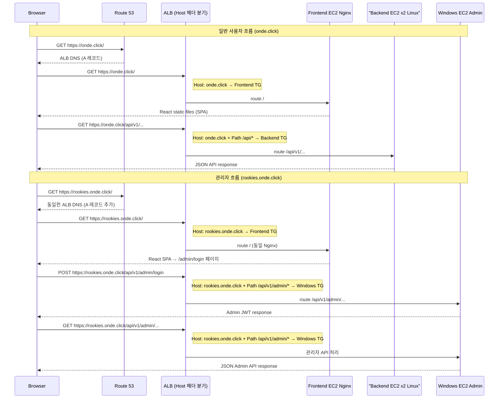

# Onde Infra

> SK쉴더스 루키즈 개발 5기 최종 프로젝트 — LBS 기반 여행 예약 및 동행 커뮤니티 플랫폼 **Onde** 서비스를 AWS 기반으로 배포하기 위한 인프라 레포지토리입니다.

---

## 목차

- [프로젝트 개요](#프로젝트-개요)
- [전체 구조](#전체-구조)
- [통신 흐름 상세 설명](#통신-흐름-상세-설명)
- [리포지토리 구조](#리포지토리-구조)
- [로컬 개발 및 빌드](#로컬-개발-및-빌드)
- [배포 및 인프라](#배포-및-인프라)
- [환경 및 요구사항](#환경-및-요구사항)
- [트러블슈팅](#트러블슈팅)

---

## 프로젝트 개요

이 저장소는 Onde 서비스의 인프라 관련 파일을 모아둔 곳입니다. 인프라란 서비스가 실제로 인터넷에서 동작하기 위해 필요한 서버, 네트워크, 데이터베이스 등의 기반 환경을 의미합니다.

포함된 항목:

- **Terraform 코드** (`terraform/`) — AWS 리소스를 코드로 자동 생성
- **Docker 파일** (`docker/`) — 애플리케이션 컨테이너 이미지 빌드

---

## 전체 구조


---
# Onde 전체 인프라 아키텍처 다이어그램

```mermaid
flowchart TB
  user[User Browser]
  adminUser[Admin Browser]
  r53["Route 53
onde.click A Alias
rookies.onde.click A Alias"]
  acm["ACM Certificate
onde.click"]
  gha["GitHub Actions
Build / Test / Docker Push"]
  repo["GitHub Repositories
Onde_Backend / Onde_Frontend / onde_infra"]

  subgraph aws[AWS Cloud]
    subgraph ecrs[ECR Repositories]
      ecrFE["ECR onde/frontend
React + Nginx 이미지"]
      ecrBE["ECR onde/backend
Spring Boot API 이미지"]
      ecrAdmin["ECR onde/backend-admin
Spring Boot Admin 이미지"]
    end

    subgraph vpc["VPC  10.0.0.0/16"]
      igw[Internet Gateway]

      subgraph public["Public Subnets 10.0.1.0/24 10.0.2.0/24  ap-northeast-2a 2c"]
        alb["ALB onde-alb
Internet-facing
HTTP to HTTPS 301 Redirect
HTTPS 443 ACM 인증서 적용"]
        natEip["Elastic IP
for NAT Gateway"]
        nat["NAT Gateway
단일 AZ public-1"]
      end

      subgraph private["Private Subnets 10.0.10.0/24 10.0.20.0/24  ap-northeast-2a 2c"]
        fe["Frontend EC2  t3.small  Ubuntu 22.04
Nginx React SPA 정적 서빙
Public Subnet ALB에서만 접근"]
        be1["Backend EC2-1  t3.small  Ubuntu 22.04
Spring Boot API api-module port 8080
Private Subnet ap-northeast-2a"]
        be2["Backend EC2-2  t3.small  Ubuntu 22.04
Spring Boot API api-module port 8080
Private Subnet ap-northeast-2c"]
        win["Windows EC2  t3.medium  Windows Server 2019
Spring Boot Admin admin-module port 8081
Private Subnet ap-northeast-2a"]
      end

      subgraph dbSubnet["DB Subnets 10.0.100.0/24 10.0.200.0/24  인터넷 차단 완전 격리"]
        rds["RDS MariaDB 10.11  db.t3.small
암호화 true  자동백업 7일
감사로그 to CloudWatch  port 3306"]
        redis["ElastiCache Redis 7  cache.t3.micro
Replication Group  1 node  port 6379"]
      end
    end

    subgraph storage[Storage]
      s3Img["S3 onde-travel-image-bucket
이미지 저장  버전관리  암호화
퍼블릭 차단  CloudFront OAC만 허용"]
      s3Trail["S3 onde-cloudtrail-logs
CloudTrail 감사 로그 저장"]
      s3Deploy["S3 onde-deploy-artifacts
Windows EC2 배포 JAR 저장"]
    end

    cf["CloudFront Distribution
S3 이미지 CDN  OAC 인증
PriceClass_100  HTTPS 강제"]

    secretsMgr["Secrets Manager
onde-project/backend-*
DB / JWT / OAuth / S3 / AES 등"]

    ssm["SSM Session Manager
EC2 키리스 접속  SSH 포트 없음"]

    cw["CloudWatch
RDS 감사 에러 로그
ALB 액세스 메트릭
EC2 CPU 네트워크 경보  SNS 알림"]

    ct["CloudTrail
API 호출 감사 로그
to S3 cloudtrail-logs"]

    iam["IAM Role  ec2-ssm-role
SSM / ECR pull / S3 접근
Secrets Manager 읽기"]
  end

  user -->|"HTTPS onde.click"| r53
  adminUser -->|"HTTPS rookies.onde.click"| r53
  r53 -->|"A Alias to ALB DNS"| igw
  igw <--> alb
  acm -->|"HTTPS 리스너 인증서"| alb

  alb -->|"onde.click /  default"| fe
  alb -->|"onde.click /api/* /oauth2/*  priority 10"| be1
  alb -->|"onde.click /api/* /oauth2/*  priority 10"| be2
  alb -->|"rookies.onde.click /api/v1/admin/*  priority 2"| win
  alb -->|"rookies.onde.click /  priority 3"| fe

  be1 -->|"JDBC 3306"| rds
  be2 -->|"JDBC 3306"| rds
  win -->|"JDBC 3306"| rds

  be1 -->|"Redis 6379"| redis
  be2 -->|"Redis 6379"| redis
  win -->|"Redis 6379"| redis

  be1 -->|"S3 PutObject GetObject"| s3Img
  be2 -->|"S3 PutObject GetObject"| s3Img

  s3Img -->|"OAC 서명"| cf
  cf -->|"이미지 CDN"| user

  natEip --> nat
  be1 & be2 & win -->|"NAT 경유 아웃바운드"| nat
  nat --> igw

  fe -->|"docker pull via NAT"| ecrFE
  be1 & be2 -->|"docker pull via NAT"| ecrBE
  win -->|"docker pull via NAT"| ecrAdmin

  iam -->|"ec2 instance profile"| fe & be1 & be2 & win
  be1 & be2 & win -->|"GetSecretValue"| secretsMgr
  be1 & be2 & win -->|"keyless access"| ssm

  rds -->|"감사 에러 로그"| cw
  alb -->|"액세스 메트릭"| cw
  ct -->|"API 감사 로그"| s3Trail

  repo --> gha
  gha -->|"docker push"| ecrFE & ecrBE & ecrAdmin
  gha -->|"JAR upload"| s3Deploy
  s3Deploy -->|"GetObject 배포"| win
```




---

## 컴포넌트 요약

| 컴포넌트 | 스펙 | 위치 | 역할 |
|----------|------|------|------|
| **ALB** | Application Load Balancer | Public Subnet | HTTPS 종단, Host/Path 기반 라우팅 |
| **Frontend EC2** | t3.small Ubuntu 22.04 | Public Subnet | Nginx React SPA 서빙 |
| **Backend EC2** | t3.small Ubuntu 22.04 | Private Subnet | Spring Boot API api-module (부하 테스트 후 backend-2 정리, 단일 인스턴스 운영) |
| **Windows EC2** | t3.medium Windows 2019 | Private Subnet | Spring Boot Admin admin-module :8081 |
| **RDS MariaDB** | db.t3.small 10.11 | DB Subnet 격리 | 메인 데이터베이스 |
| **ElastiCache Redis** | cache.t3.micro Redis 7 | DB Subnet | 세션/캐시 |
| **S3 이미지** | - | 글로벌 | 여행 이미지 저장 |
| **S3 CloudTrail** | - | 글로벌 | 감사 로그 저장 |
| **S3 배포** | - | 글로벌 | Windows JAR 배포용 |
| **CloudFront** | PriceClass_100 | 글로벌 | S3 이미지 CDN |
| **ECR** | 3개 레포 | ap-northeast-2 | 도커 이미지 저장 |
| **Secrets Manager** | onde-project/backend-* | ap-northeast-2 | 민감정보 관리 |
| **CloudWatch** | - | ap-northeast-2 | 로그 / 메트릭 / 알람 |
| **CloudTrail** | - | ap-northeast-2 | API 감사 |
| **Route 53** | A Alias 계획 | 글로벌 | onde.click / rookies.onde.click |
| **ACM** | onde.click 인증서 | ap-northeast-2 | HTTPS 인증서 |

---

# Onde 도메인 분리 시퀀스 다이어그램

## 아키텍처 흐름



## ALB 라우팅 우선순위 요약

| Priority | Host 조건 | Path 조건 | Target Group |
|----------|-----------|-----------|--------------|
| **2** | `rookies.onde.click` | `/api/v1/admin/*` | Windows EC2 TG |
| **3** | `rookies.onde.click` | `*` (전체) | Frontend TG |
| **10** | `onde.click` | `/api/*`, `/oauth2/*`, `/login/oauth2/*` | Linux Backend TG |
| **default** | `onde.click` | `*` | Frontend TG |

> 기존 priority 5 규칙(`onde.click`에서 `/api/v1/admin/*` 허용)은 **삭제** — admin API는 `rookies.onde.click`으로만 접근 가능

## Route 53 레코드

| 도메인 | 타입 | 값 |
|--------|------|-----|
| `onde.click` | A (Alias) | ALB DNS (기존) |
| `rookies.onde.click` | A (Alias) | ALB DNS (동일, 신규 추가) |

---

## 통신 흐름 상세 설명

사용자가 `https://onde.click`에 접속해서 여행 목록을 보는 전체 흐름입니다.

```
1. 사용자가 브라우저에 https://onde.click 입력

2. Route 53이 onde.click → ALB 주소로 변환 (DNS 조회)

3. ALB가 HTTPS 요청 수신
   - ACM 인증서로 SSL/TLS 암호화 해제
   - URL 경로 확인

4-A. URL이 /api/v1/... 인 경우
   → 백엔드 Target Group → 백엔드 EC2 컨테이너 → DB 조회 → JSON 응답 반환

4-B. URL이 /admin/... 인 경우
   → Windows 백엔드 Target Group → Windows EC2 컨테이너 → 관리자 기능 처리

4-C. 그 외 URL인 경우
   → 프론트엔드 Target Group → 프론트엔드 EC2 컨테이너
   → Nginx가 index.html, JS, CSS 파일 반환

5. 브라우저가 화면 렌더링
   - JS(React)가 실행되며 /api/v1/... 로 데이터 추가 요청
   - 위 4-A 과정 반복

6. 이미지 조회 시
   - CloudFront URL로 요청 → 캐시 HIT 시 즉시 반환
   - 캐시 MISS 시 CloudFront → S3(OAC)에서 이미지 가져와 캐싱 후 반환
```

---

## 리포지토리 구조

```
onde-infra/
├── docker/
│   ├── backend/     # 백엔드 Dockerfile
│   └── frontend/    # 프론트엔드 Dockerfile
├── terraform/       # AWS 인프라 코드 (VPC, EC2, RDS, S3 등)
│   ├── main.tf
│   ├── variables.tf
│   └── outputs.tf
└── README.md
```

---

## 로컬 개발 및 빌드

### 사전 요구사항
- Docker
- Terraform (인프라 작업 시)
- AWS CLI

### Docker 이미지 빌드

```bash
# 프론트엔드 이미지 빌드
cd docker/frontend
docker build -t onde-frontend:local .

# 백엔드 이미지 빌드
cd docker/backend
docker build -t onde-backend:local .
```

### Terraform 실행

```bash
cd terraform

# 초기화 (최초 1회)
terraform init

# 변경사항 미리보기
terraform plan

# 실제 적용
terraform apply

# 전체 삭제 (주의!)
terraform destroy
```

---

## 배포 및 인프라

### 전체 배포 순서

Terraform으로 AWS 인프라 생성

VPC, 서브넷, 보안 그룹 생성
EC2 인스턴스 생성 및 Docker 설치
RDS, S3, ElastiCache 생성


AWS 콘솔에서 ALB 생성 및 설정

HTTPS 리스너(443), HTTP 리스너(80) 추가
URL 경로별 라우팅 규칙 설정
ACM 인증서 연결


GitHub Actions가 자동 배포

코드를 GitHub에 Push하면 자동으로 실행
Docker 이미지 빌드 → ECR 푸시 → EC2에서 컨테이너 재시작

### 운영 중 배포 업데이트 방법

```bash
# 새 이미지 빌드 및 푸시
docker build -t onde-backend:v1.1 ./docker/backend
docker push <ECR_URI>/onde-backend:v1.1

# EC2에서 최신 이미지로 컨테이너 재시작
# GitHub Actions가 자동으로 처리하거나, SSM Session Manager를 통해 수동 실행
docker pull <ECR_URI>/onde-backend:v1.1
docker stop onde-backend && docker rm onde-backend
docker run -d --name onde-backend <ECR_URI>/onde-backend:v1.1
```

---

## 환경 및 요구사항

| 항목 | 버전/요구사항 |
|------|--------------|
| Node.js / npm | 프론트엔드 개발 시 필요 |
| Java / Gradle | 백엔드 빌드 시 필요 |
| Docker | 컨테이너 빌드 및 실행 |
| Terraform | v1.5+ 권장 |
| AWS CLI | AWS 리소스 접근 |
| AWS 계정 | 적절한 IAM 권한 필요 |

### 필요한 AWS IAM 권한
- EC2, VPC, RDS, S3 생성/관리
- ACM 인증서 요청
- Route 53 레코드 관리
- SSM Parameter Store 읽기/쓰기
- ECR 이미지 푸시/풀

---

## 트러블슈팅

### 1. Spring Security CORS 설정 + BCrypt 해시 버전 불일치

**문제**
로컬 개발 환경에서 프론트엔드(React)에서 백엔드 API 로그인 요청 시 CORS 에러가 발생했고, 에러를 해결한 이후에도 로그인이 계속 실패했습니다.

**원인**
1. Spring Security의 CORS 설정이 `nginx` 리버스 프록시를 통한 요청 출처를 허용하지 않고 있었음
2. MariaDB 시드 데이터의 비밀번호가 이전 버전 BCrypt로 해시되어 있어, 현재 애플리케이션의 BCrypt 버전과 해시 포맷이 맞지 않음

**해결**
- `SecurityConfig`에 `CorsConfigurationSource`를 명시적으로 등록하고, 허용 Origin에 nginx 프록시 주소를 추가
- 시드 데이터의 비밀번호를 현재 BCrypt 버전으로 재해시하여 MariaDB에 재삽입

```java
@Bean
public CorsConfigurationSource corsConfigurationSource() {
    CorsConfiguration configuration = new CorsConfiguration();
    configuration.setAllowedOrigins(List.of("https://onde.click", "http://localhost:3000"));
    configuration.setAllowedMethods(List.of("GET", "POST", "PUT", "DELETE"));
    configuration.setAllowCredentials(true);
    UrlBasedCorsConfigurationSource source = new UrlBasedCorsConfigurationSource();
    source.registerCorsConfiguration("/**", configuration);
    return source;
}
```

---

### 2. EC2 디스크 공간 100% 소진으로 인한 서버 다운

**문제**
운영 중이던 `onde.click` EC2 인스턴스가 갑자기 응답하지 않는 문제가 발생했습니다.

**원인**
Docker 이미지 빌드 및 컨테이너 재시작 과정에서 사용하지 않는 이전 이미지와 컨테이너가 정리되지 않고 계속 누적되어 EC2 디스크 용량이 100% 소진됨

**해결**
```bash
# 미사용 Docker 리소스 정리
docker system prune -af

# 저널 로그 용량 정리
journalctl --vacuum-time=3d
```
이후 CloudWatch Agent로 디스크 사용량 모니터링 및 알람을 설정해 재발을 방지했습니다.

---

### 3. RDS 보안 그룹 인바운드 규칙 불일치로 인한 연결 실패

**문제**
배포 초기, 백엔드 EC2 컨테이너가 RDS(MariaDB)에 연결하지 못하는 문제가 발생했습니다.

**원인**
RDS 보안 그룹의 인바운드 규칙이 백엔드 EC2의 보안 그룹을 정확히 참조하지 않고 있었음 — EC2 보안 그룹이 재생성되며 ID가 변경되었으나 RDS 인바운드 규칙에는 반영되지 않았음

**해결**
Terraform의 RDS 보안 그룹 모듈에서 인바운드 규칙의 `source_security_group_id`를 백엔드 EC2 보안 그룹 리소스를 직접 참조하도록 수정하여, 이후 보안 그룹이 재생성되어도 자동으로 최신 ID가 반영되도록 개선했습니다.

```hcl
resource "aws_security_group_rule" "rds_from_backend" {
  type                     = "ingress"
  from_port                = 3306
  to_port                  = 3306
  protocol                 = "tcp"
  security_group_id        = aws_security_group.rds.id
  source_security_group_id = aws_security_group.backend_ec2.id
}
```

---

### 4. Burp Suite·ZAP 모의해킹을 통한 권한상승 및 결제 조작 취약점 발견

**문제**
서비스 배포 후 Burp Suite와 OWASP ZAP을 활용해 자체 모의해킹을 진행한 결과, 파라미터 조작을 통한 두 가지 주요 취약점이 발견되었습니다.

**발견 1 — role 파라미터 조작을 통한 권한 상승**
회원가입 요청의 `role` 파라미터 값을 클라이언트 단에서 임의로 조작하면 일반 사용자가 `SUPER_ADMIN` 권한으로 가입할 수 있는 취약점이 확인되었습니다.

**발견 2 — totalPrice 파라미터 조작을 통한 결제 금액 변조**
결제 요청의 `totalPrice` 파라미터를 클라이언트 단에서 조작하면 실제 상품 금액과 무관하게 임의의 금액(예: 1원)으로 결제가 승인되는 취약점이 확인되었습니다.

**해결**
두 취약점 모두 이행점검 이후 백엔드에서 클라이언트가 전달한 값을 신뢰하지 않고, 서버 측에서 권한과 금액을 재검증하도록 직접 수정 조치했습니다.
